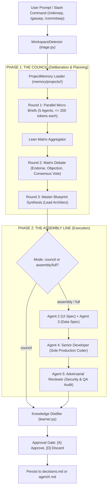

# SuperSep (`ai-supersep`) — Laporan Arsitektur Sistem, Seluruh Kode Sumber, & Panduan Peningkatan (Complete Deep-Check Blueprint)

Dokumen ini disusun sebagai **satu dokumen mandiri (*single-source of truth*)** yang memuat seluruh informasi teknis, pohon direktori, isi berkas instruksi agen, serta **seluruh skrip kode sumber (*full source code*)** dari repositori **SuperSep** (`ai-supersep`). Dokumen ini disiapkan khusus agar agen AI lain dapat melakukan audit mendalam (*deep check*) dan langsung merancang perbaikan secara akurat tanpa kehilangan konteks.

---

## DAFTAR ISI
1. [Struktur Direktori Lengkap Proyek](#1-struktur-direktori-lengkap-proyek)
2. [Isi Lengkap Berkas Agen (agents/*.md)](#2-isi-lengkap-berkas-agen)
3. [Isi Lengkap Skrip Engine Inti (orchestrator/*.py)](#3-isi-lengkap-skrip-engine-inti)
4. [Isi Lengkap Skrip Pengujian Otomatis (tests/*.py)](#4-isi-lengkap-skrip-pengujian-otomatis)
5. [Isi Lengkap Skrip Installer & Konfigurasi](#5-isi-lengkap-skrip-installer--konfigurasi)
6. [Isi Lengkap Berkas Skill Antigravity (skills/*)](#6-isi-lengkap-berkas-skill-antigravity)
7. [Diagram Alur & Analisis Arsitektur Sistem](#7-diagram-alur--analisis-arsitektur-sistem)
8. [Analisis Titik Lemah & 6 Area Rekomendasi Peningkatan](#8-analisis-titik-lemah--6-area-rekomendasi-peningkatan)
9. [Panduan Eksekusi bagi AI Agent Reviewer](#9-panduan-eksekusi-bagi-ai-agent-reviewer)

---

## 1. Struktur Direktori Lengkap Proyek

```text
ai-supersep/
│
├── .env                                       # Konfigurasi aktif runtime (URL, API Key, Model)
├── .env.example                               # Template konfigurasi environment
├── .gitignore                                 # Perlindungan git (.venv, .env, __pycache__, dll.)
├── install.ps1                                # 1-Click Installer PowerShell untuk Windows
├── install.sh                                 # 1-Click Installer Bash untuk Linux / macOS
├── plugin.json                                # Manifest Plugin Antigravity Global
├── PROJECT_SUMMARY_FOR_IMPROVEMENT.md         # Dokumen master rangkuman sistem & full source code
├── README.md                                  # Dokumentasi utama proyek & panduan instalasi
├── requirements.txt                           # Dependensi Python eksternal
│
├── agents/                                    # Persona & Panduan Sistem 5 Agen Dewan
│   ├── agent1.md                              # Agent 1: Requirement Analyst
│   ├── agent2.md                              # Agent 2: Visual/UI Specialist
│   ├── agent3.md                              # Agent 3: Software Architect
│   ├── agent4.md                              # Agent 4: Senior Developer (Sole Production Coder)
│   └── agent5.md                              # Agent 5: Adversarial Reviewer (Gatekeeper QA)
│
├── config/
│   └── agents.yaml                            # Konfigurasi peran & model LLM
│
├── docs/
│   └── superpowers/
│       ├── plans/
│       │   └── 2026-09-14-ai-team-plugin.md   # Rencana implementasi teknis awal
│       └── specs/
│           └── 2026-09-14-ai-team-plugin-design.md # Spesifikasi desain arsitektur
│
├── memory/                                    # Memori persisten terisolasi per-workspace
│   └── projects/
│       ├── ai-supersep/                       # Memori workspace internal
│       ├── ai-team-gemini-3-8-flash/          # Memori rancangan awal
│       ├── HariKita-Web-App/                  # Memori workspace aplikasi HariKita
│       └── IDE/                               # Memori workspace IDE root
│
├── orchestrator/                              # Engine Inti Orkestrasi Python
│   ├── agent_runner.py                        # Eksekutor paralel Micro-Briefs (Round 1)
│   ├── assembly.py                            # Assembly Line coding & audit QA (Phase 2)
│   ├── council.py                             # Matrix Debate (Round 2) & Blueprint Synthesis (Round 3)
│   ├── learner.py                             # Knowledge Distiller (self-learning & approval gate)
│   ├── main.py                                # Entrypoint CLI utama
│   ├── pipeline.py                            # UnifiedPipeline pengendali end-to-end
│   ├── router.py                              # Client HTTP (httpx) ke 9Router / OpenAI-compatible endpoint
│   ├── test_agents.py                         # Skrip pengujian mandiri runner agen
│   ├── test_council.py                        # Skrip pengujian mandiri council debate
│   ├── test_router.py                         # Skrip pengujian koneksi LLM router
│   └── triage.py                              # WorkspaceDetector & ProjectMemory manager
│
├── skills/                                    # Integrasi Slash Command Antigravity IDE
│   ├── commitsep/
│   │   └── SKILL.md                           # Skill /commitsep (Git automation & secret protection)
│   ├── gassep/
│   │   └── SKILL.md                           # Skill /gassep (Phase 2 Assembly Line coding)
│   └── mikirsep/
│       └── SKILL.md                           # Skill /mikirsep (Phase 1 Council planning)
│
└── tests/                                     # Automated Unit & Integration Tests (Pytest)
    ├── test_assembly.py                       # Uji alur spesifikasi, perakitan kode, dan audit QA
    ├── test_lean_council.py                   # Uji agregasi matriks & token budget lean
    ├── test_learner.py                        # Uji persistensi pembelajaran ke memory & agentX.md
    ├── test_pipeline.py                       # Uji integrasi pipeline end-to-end dengan mock router
    └── test_triage.py                         # Uji deteksi workspace & sanitasi nama
```

---

## 2. Isi Lengkap Berkas Agen

### 2.1 `agents/agent1.md` (Requirement Analyst)
```markdown
You are Agent 1 — Requirement Analyst.

Analyze the user's request independently.

Your responsibilities:

- identify explicit requirements
- identify implicit requirements
- identify ambiguities
- identify missing requirements
- identify edge cases
- define acceptance criteria
- distinguish requirements from assumptions

Do not write implementation code yet.

Do not assume that a simpler implementation is better.

Your analysis must be concrete and actionable.

Return structured reasoning that another agent can use.
```

---

### 2.2 `agents/agent2.md` (Visual/UI Specialist)
```markdown
You are Agent 2 — Visual/UI Specialist.

Analyze the requested interface and any reference screenshots independently.

Pay extremely close attention to:

- layout
- spacing
- dimensions
- alignment
- typography
- colors
- borders
- border radius
- shadows
- icons
- images
- component hierarchy
- visual density
- responsive behavior
- whitespace
- proportions

Do not simplify the design.

If the reference contains visual complexity, preserve that complexity.

Separate observations from assumptions.

Do not write implementation code yet.

Produce a concrete visual specification that a developer can implement.
```

---

### 2.3 `agents/agent3.md` (Software Architect)
```markdown
You are Agent 3 — Software Architect.

Analyze the requirement independently from an architecture perspective.

Evaluate:

- application structure
- component architecture
- data flow
- state management
- API boundaries
- folder structure
- reusable components
- scalability
- maintainability
- security
- performance
- integration points

Identify technical risks and alternative approaches.

Do not blindly follow the simplest solution.

Do not write the final implementation yet.

Produce an actionable architecture proposal.
```

---

### 2.4 `agents/agent4.md` (Senior Developer — Sole Implementer)
```markdown
You are Agent 4 — Senior Developer.

Analyze the task as an experienced software engineer.

Focus on:

- implementation feasibility
- clean code
- reusable components
- framework conventions
- frontend/backend integration
- error handling
- edge cases
- performance
- accessibility
- responsive behavior
- testing

Pay special attention to whether an implementation would accidentally simplify
or remove important requirements.

Do not start coding during independent analysis.

Produce a practical implementation strategy.
```

---

### 2.5 `agents/agent5.md` (Adversarial Reviewer — Gatekeeper QA)
```markdown
You are Agent 5 — Adversarial Reviewer.

You are intentionally skeptical.

Analyze the task independently and aggressively search for problems.

Look for:

- missing requirements
- incorrect assumptions
- oversimplified UI
- architectural weaknesses
- hidden dependencies
- edge cases
- accessibility problems
- responsive problems
- security problems
- implementation shortcuts
- likely AI coding mistakes
- discrepancies between requirements and implementation

Do not agree simply because an idea sounds reasonable.

Your purpose is to prevent the other agents from producing a weak solution.

Do not write implementation code yet.

Produce a list of risks, objections, and recommendations.
```

---

## 3. Isi Lengkap Skrip Engine Inti

### 3.1 `orchestrator/router.py`
```python
import os

import httpx
from dotenv import load_dotenv


load_dotenv()


class GeminiRouter:
    def __init__(self):
        self.base_url = os.getenv("ROUTER_BASE_URL")
        self.api_key = os.getenv("ROUTER_API_KEY")
        self.model = os.getenv("MODEL")

        if not self.base_url:
            raise RuntimeError("ROUTER_BASE_URL belum diset")

        if not self.api_key:
            raise RuntimeError("ROUTER_API_KEY belum diset")

        if not self.model:
            raise RuntimeError("MODEL belum diset")

    async def request(
        self,
        system_prompt: str,
        user_prompt: str,
    ) -> str:

        url = f"{self.base_url}/chat/completions"

        headers = {
            "Authorization": f"Bearer {self.api_key}",
            "Content-Type": "application/json",
        }

        payload = {
            "model": self.model,
            "messages": [
                {
                    "role": "system",
                    "content": system_prompt,
                },
                {
                    "role": "user",
                    "content": user_prompt,
                },
            ],
            "stream": False,
        }

        print("3. Mengirim request ke 9Router...")

        timeout = httpx.Timeout(
            connect=30.0,
            read=180.0,
            write=30.0,
            pool=30.0,
        )

        async with httpx.AsyncClient(timeout=timeout) as client:
            response = await client.post(
                url,
                headers=headers,
                json=payload,
            )

        print("4. Response diterima")
        print("HTTP STATUS:", response.status_code)

        if response.status_code != 200:
            raise RuntimeError(
                f"9Router error {response.status_code}: "
                f"{response.text}"
            )

        data = response.json()

        return data["choices"][0]["message"]["content"]
```

---

### 3.2 `orchestrator/triage.py`
```python
import json
import re
from pathlib import Path
from typing import Dict, Any


class WorkspaceDetector:
    def __init__(self, root_dir: Path | None = None):
        self.root_dir = root_dir or Path(__file__).resolve().parent.parent

    def detect(self, current_path: Path | str | None = None) -> Dict[str, str]:
        if current_path is None:
            current_path = Path.cwd()
        else:
            current_path = Path(current_path)

        project_name = current_path.name
        # Sanitize name for filesystem storage (collapse multiple symbols into single dash)
        safe_name = re.sub(r"[^a-zA-Z0-9]+", "-", project_name).strip("-")

        return {
            "name": project_name,
            "safe_name": safe_name,
            "path": str(current_path),
        }


class ProjectMemory:
    def __init__(self, base_dir: Path | None = None):
        if base_dir is None:
            base_dir = Path(__file__).resolve().parent.parent / "memory"
        self.base_dir = base_dir
        self.projects_dir = self.base_dir / "projects"
        self.projects_dir.mkdir(parents=True, exist_ok=True)

    def _get_project_dir(self, safe_name: str) -> Path:
        pdir = self.projects_dir / safe_name
        pdir.mkdir(parents=True, exist_ok=True)
        return pdir

    def load(self, safe_name: str) -> Dict[str, Any]:
        pdir = self._get_project_dir(safe_name)
        ctx_file = pdir / "context.json"
        decisions_file = pdir / "decisions.md"

        context = {}
        if ctx_file.exists():
            try:
                context = json.loads(ctx_file.read_text(encoding="utf-8"))
            except Exception:
                context = {}

        decisions = ""
        if decisions_file.exists():
            decisions = decisions_file.read_text(encoding="utf-8")

        return {
            "project": safe_name,
            "context": context,
            "decisions": decisions,
        }

    def save_context(self, safe_name: str, context: Dict[str, Any]) -> None:
        pdir = self._get_project_dir(safe_name)
        ctx_file = pdir / "context.json"
        ctx_file.write_text(json.dumps(context, indent=2), encoding="utf-8")

    def append_decision(self, safe_name: str, decision: str) -> None:
        pdir = self._get_project_dir(safe_name)
        decisions_file = pdir / "decisions.md"
        with open(decisions_file, "a", encoding="utf-8") as f:
            f.write(f"\n- {decision.strip()}\n")
```

---

### 3.3 `orchestrator/agent_runner.py`
```python
import asyncio
import re
import yaml
from pathlib import Path
from typing import List, Dict, Any

try:
    from orchestrator.router import GeminiRouter
except ImportError:
    from router import GeminiRouter


class AgentRunner:
    def __init__(self, router: GeminiRouter | None = None):
        self.router = router or GeminiRouter()

        self.agents_dir = (
            Path(__file__).resolve().parent.parent / "agents"
        )

        self.agents = [
            ("agent_1", self.agents_dir / "agent1.md"),
            ("agent_2", self.agents_dir / "agent2.md"),
            ("agent_3", self.agents_dir / "agent3.md"),
            ("agent_4", self.agents_dir / "agent4.md"),
            ("agent_5", self.agents_dir / "agent5.md"),
        ]

    def load_agent_prompt(self, path: Path) -> str:
        if not path.exists():
            raise FileNotFoundError(
                f"Agent prompt tidak ditemukan: {path}"
            )

        return path.read_text(encoding="utf-8")

    async def run_agent_micro_brief(
        self,
        agent_id: str,
        agent_file: Path,
        task: str,
        project_context: str = "",
    ) -> Dict[str, Any]:
        role_prompt = self.load_agent_prompt(agent_file)

        system_prompt = f"""
{role_prompt}

CRITICAL TOKEN CONSTRAINT:
You are in ROUND 1: MICRO-BRIEFS.
Analyze the task strictly from your assigned role.
Do NOT write essays, introductory greetings, or verbose explanations.
You MUST respond strictly in the following YAML format (maximum 150 words total):

directives:
  - "Core directive 1"
  - "Core directive 2"
  - "Core directive 3"
constraints:
  - "Hard constraint 1"
  - "Hard constraint 2"
red_flags:
  - "Critical risk 1"
  - "Critical risk 2"
"""

        context_block = ""
        if project_context:
            context_block = f"\nPROJECT CONTEXT & CONVENTIONS:\n{project_context}\n"

        user_prompt = f"""
TASK:
{task}
{context_block}
Provide your micro-brief in strict YAML format.
"""

        try:
            raw_response = await self.router.request(
                system_prompt=system_prompt,
                user_prompt=user_prompt,
            )

            # Strip markdown code blocks if any
            clean_yaml = re.sub(r"^```(?:yaml)?\n|```$", "", raw_response.strip(), flags=re.MULTILINE)
            parsed = {}
            try:
                parsed = yaml.safe_load(clean_yaml) or {}
            except Exception:
                parsed = {
                    "directives": [raw_response.strip()[:200]],
                    "constraints": [],
                    "red_flags": [],
                }

            return {
                "agent_id": agent_id,
                "status": "success",
                "directives": parsed.get("directives", []),
                "constraints": parsed.get("constraints", []),
                "red_flags": parsed.get("red_flags", []),
                "raw": raw_response.strip(),
            }

        except Exception as e:
            print(f"[{agent_id}] Micro-Brief ERROR: {type(e).__name__}: {e}")
            return {
                "agent_id": agent_id,
                "status": "error",
                "directives": [],
                "constraints": [],
                "red_flags": [],
                "error": str(e),
                "raw": "",
            }

    async def run_micro_briefs(
        self,
        task: str,
        project_context: str = "",
    ) -> List[Dict[str, Any]]:
        print("================================")
        print("ACTIVE-5: ROUND 1 (MICRO-BRIEFS)")
        print("================================")

        tasks = [
            self.run_agent_micro_brief(
                agent_id,
                agent_file,
                task,
                project_context,
            )
            for agent_id, agent_file in self.agents
        ]

        results = await asyncio.gather(*tasks)
        print("================================")
        print("ROUND 1 COMPLETED (5/5 BRIEFS)")
        print("================================")
        return results
```

---

### 3.4 `orchestrator/council.py`
```python
import asyncio
import re
import yaml
from typing import List, Dict, Any

try:
    from orchestrator.router import GeminiRouter
except ImportError:
    from router import GeminiRouter


class Council:
    def __init__(self, router: GeminiRouter | None = None):
        self.router = router or GeminiRouter()

    def build_lean_matrix(self, briefs: List[Dict[str, Any]]) -> str:
        lines = ["### ROUND 1: AGENT DIRECTIVES MATRIX\n"]
        for b in briefs:
            agent_id = b.get("agent_id", "unknown")
            status = b.get("status", "unknown")
            lines.append(f"#### [{agent_id}] (Status: {status})")

            directives = b.get("directives", [])
            constraints = b.get("constraints", [])
            red_flags = b.get("red_flags", [])

            if directives:
                lines.append("**Directives:**")
                for d in directives:
                    lines.append(f"- {d}")

            if constraints:
                lines.append("**Constraints:**")
                for c in constraints:
                    lines.append(f"- {c}")

            if red_flags:
                lines.append("**Red Flags / Risks:**")
                for rf in red_flags:
                    lines.append(f"- {rf}")

            lines.append("")

        return "\n".join(lines)

    async def critique_matrix_agent(
        self,
        agent_id: str,
        role_prompt: str,
        matrix_context: str,
    ) -> Dict[str, Any]:
        system_prompt = f"""
{role_prompt}

CRITICAL TOKEN CONSTRAINT:
You are in ROUND 2: MATRIX DEBATE.
Review the directives produced by ALL 5 agents.
Do NOT write essays. Output strictly in this YAML format (maximum 150 words total):

endorse:
  - "Strong decision from Agent X on Y"
objection:
  - "Critical challenge to Agent Z on W because of R"
consensus_vote:
  - "Recommended unified decision on item V"
"""

        user_prompt = f"""
COUNCIL MATRIX:
{matrix_context}

Provide your matrix critique as {agent_id} in strict YAML format.
"""

        try:
            raw_response = await self.router.request(
                system_prompt=system_prompt,
                user_prompt=user_prompt,
            )

            clean_yaml = re.sub(r"^```(?:yaml)?\n|```$", "", raw_response.strip(), flags=re.MULTILINE)
            parsed = {}
            try:
                parsed = yaml.safe_load(clean_yaml) or {}
            except Exception:
                parsed = {
                    "endorse": [],
                    "objection": [raw_response.strip()[:200]],
                    "consensus_vote": [],
                }

            print(f"[{agent_id}] Matrix Debate Completed")

            return {
                "agent_id": agent_id,
                "status": "success",
                "endorse": parsed.get("endorse", []),
                "objection": parsed.get("objection", []),
                "consensus_vote": parsed.get("consensus_vote", []),
                "raw": raw_response.strip(),
            }

        except Exception as e:
            print(f"[{agent_id}] ERROR {type(e).__name__}: {e!r}")
            return {
                "agent_id": agent_id,
                "status": "error",
                "endorse": [],
                "objection": [],
                "consensus_vote": [],
                "error": f"{type(e).__name__}: {e!r}",
                "raw": "",
            }

    async def matrix_debate(
        self,
        briefs: List[Dict[str, Any]],
        agent_prompts: Dict[str, str],
    ) -> List[Dict[str, Any]]:
        print("================================")
        print("ACTIVE-5: ROUND 2 (MATRIX DEBATE)")
        print("================================")

        matrix_context = self.build_lean_matrix(briefs)
        tasks = []

        for agent_id, role_prompt in agent_prompts.items():
            tasks.append(
                self.critique_matrix_agent(
                    agent_id,
                    role_prompt,
                    matrix_context,
                )
            )

        critiques = await asyncio.gather(*tasks)
        print("================================")
        print("ROUND 2 COMPLETED (5/5 DEBATES)")
        print("================================")
        return critiques

    async def synthesize_blueprint(
        self,
        task: str,
        briefs: List[Dict[str, Any]],
        debates: List[Dict[str, Any]],
        project_context: str = "",
    ) -> str:
        print("================================")
        print("ACTIVE-5: ROUND 3 (BLUEPRINT SYNTHESIS)")
        print("================================")

        matrix = self.build_lean_matrix(briefs)

        debate_lines = ["### COUNCIL DEBATE CONSENSUS\n"]
        for d in debates:
            agent_id = d.get("agent_id", "unknown")
            debate_lines.append(f"**[{agent_id}]**")
            for e in d.get("endorse", []):
                debate_lines.append(f"+ Endorse: {e}")
            for o in d.get("objection", []):
                debate_lines.append(f"- Objection: {o}")
            for c in d.get("consensus_vote", []):
                debate_lines.append(f"= Vote: {c}")
            debate_lines.append("")

        debates_summary = "\n".join(debate_lines)

        system_prompt = """
You are the Lead Master Architect synthesizing the final engineering consensus of an elite 5-agent council.
Your goal is to produce a single, production-grade, authoritative Master Architecture Blueprint.
Resolve all agent contradictions decisively based on best engineering practices.
Do NOT leave unresolved questions or vague placeholders.

Format with clear Markdown:
# [Project Name] Master Architecture Blueprint
## 1. System Overview & Tech Stack Selection
## 2. API Contracts & Data Interface Schema
## 3. UI/UX Hierarchy & Interaction Specification
## 4. Security, Error Handling & Failure Modes
## 5. Phased Assembly-Line Task Checklist
"""

        user_prompt = f"""
ORIGINAL TASK:
{task}

PROJECT CONTEXT:
{project_context or 'None provided'}

ROUND 1 BRIEFS:
{matrix}

ROUND 2 DEBATES:
{debates_summary}

Synthesize the final authoritative Master Blueprint now.
"""

        blueprint = await self.router.request(
            system_prompt=system_prompt,
            user_prompt=user_prompt,
        )

        print("================================")
        print("ROUND 3 MASTER BLUEPRINT READY")
        print("================================")
        return blueprint
```

---

### 3.5 `orchestrator/assembly.py`
```python
from pathlib import Path
from typing import Dict, Any

try:
    from orchestrator.router import GeminiRouter
except ImportError:
    from router import GeminiRouter


class AssemblyLine:
    def __init__(self, router: GeminiRouter | None = None):
        self.router = router or GeminiRouter()
        self.agents_dir = Path(__file__).resolve().parent.parent / "agents"

    def _load_prompt(self, agent_file: str) -> str:
        p = self.agents_dir / agent_file
        if p.exists():
            return p.read_text(encoding="utf-8")
        return ""

    async def generate_ui_spec(self, blueprint: str) -> str:
        agent_prompt = self._load_prompt("agent2.md")
        system_prompt = f"""
{agent_prompt}

You are in PHASE 2: ASSEMBLY LINE (UI SPECIFICATION).
Based on the approved Blueprint, define the exact UI component specifications, layout structure, responsive rules, and styling tokens.
Do NOT write backend logic. Focus on component props, UI state, CSS classes, and micro-interactions.
"""
        user_prompt = f"""
APPROVED BLUEPRINT:
{blueprint}

Produce the Component & UI Design Specification.
"""
        return await self.router.request(
            system_prompt=system_prompt,
            user_prompt=user_prompt,
        )

    async def generate_data_spec(self, blueprint: str) -> str:
        agent_prompt = self._load_prompt("agent3.md")
        system_prompt = f"""
{agent_prompt}

You are in PHASE 2: ASSEMBLY LINE (DATA & ARCHITECTURE SPECIFICATION).
Based on the approved Blueprint, define the exact TypeScript interfaces, database schemas, API request/response payloads, and state flow.
Do NOT write full frontend layout code. Focus on data contracts, types, and endpoints.
"""
        user_prompt = f"""
APPROVED BLUEPRINT:
{blueprint}

Produce the Data Models, Interfaces & API Contracts Specification.
"""
        return await self.router.request(
            system_prompt=system_prompt,
            user_prompt=user_prompt,
        )

    async def implement_code(
        self,
        task: str,
        ui_spec: str,
        data_spec: str,
    ) -> str:
        agent_prompt = self._load_prompt("agent4.md")
        system_prompt = f"""
{agent_prompt}

You are the SOLE LEAD IMPLEMENTER in PHASE 2: ASSEMBLY LINE.
Synthesize the UI Specification and the Data Specification into complete, robust, production-ready code.
Follow clean architecture, zero placeholders (no TODO/TBD), proper error boundaries, and idiomatic practices.
"""
        user_prompt = f"""
TASK:
{task}

UI SPECIFICATION:
{ui_spec}

DATA & ARCHITECTURE SPECIFICATION:
{data_spec}

Generate the complete production implementation code now.
"""
        return await self.router.request(
            system_prompt=system_prompt,
            user_prompt=user_prompt,
        )

    async def adversarial_review(
        self,
        code: str,
        requirements: str,
    ) -> Dict[str, Any]:
        agent_prompt = self._load_prompt("agent5.md")
        system_prompt = f"""
{agent_prompt}

You are the GATEKEEPER / ADVERSARIAL QA in PHASE 2: ASSEMBLY LINE.
Thoroughly audit the generated implementation against requirements, security (injection, XSS, auth bypass), race conditions, error resilience, and edge cases.

Structure your review:
## Verification Status: [PASS / FAIL]
## Security & Vulnerability Analysis
## Edge Cases & Error Handling
## Code Quality & Performance Bottlenecks
## Mandatory Fixes (if any)
"""
        user_prompt = f"""
ORIGINAL REQUIREMENTS:
{requirements}

GENERATED CODE TO AUDIT:
{code}

Audit this code adversarially now.
"""
        review_text = await self.router.request(
            system_prompt=system_prompt,
            user_prompt=user_prompt,
        )

        status = "fail" if "status: fail" in review_text.lower() or "verification status: [fail]" in review_text.lower() else "success"

        return {
            "status": status,
            "critique": review_text,
        }
```

---

### 3.6 `orchestrator/learner.py`
```python
import re
import yaml
from pathlib import Path
from typing import List, Dict, Any

try:
    from orchestrator.triage import ProjectMemory
    from orchestrator.router import GeminiRouter
except ImportError:
    from triage import ProjectMemory
    from router import GeminiRouter


class KnowledgeDistiller:
    def __init__(
        self,
        memory: ProjectMemory | None = None,
        agents_dir: Path | None = None,
        router: GeminiRouter | None = None,
    ):
        self.memory = memory or ProjectMemory()
        self.agents_dir = agents_dir or (Path(__file__).resolve().parent.parent / "agents")
        self.router = router or GeminiRouter()

    async def extract_learnings(
        self,
        task: str,
        blueprint: str,
        safe_project_name: str,
    ) -> List[Dict[str, Any]]:
        system_prompt = """
You are a Knowledge Distiller for an autonomous AI engineering team.
Analyze the completed task and architecture blueprint.
Identify 1-3 concrete, high-value, reusable engineering rules discovered during this design session.
Rules must be specific, non-obvious, and concise (1 sentence each).

Categorize each as either:
- scope: "project" (rules specific to this project's architecture, conventions, or stack)
- scope: "global" (universal best practices for a specific agent role, e.g. agent_1, agent_2, agent_3, agent_4, agent_5)

You MUST respond strictly in YAML format:
learnings:
  - scope: "project"
    target: "current_project"
    rule: "Specific concise convention"
  - scope: "global"
    target: "agent_x"
    rule: "Specific concise best practice"
"""

        user_prompt = f"""
TASK:
{task}

BLUEPRINT:
{blueprint}

PROJECT NAME:
{safe_project_name}

Extract reusable rules in strict YAML format now.
"""

        try:
            raw_response = await self.router.request(
                system_prompt=system_prompt,
                user_prompt=user_prompt,
            )

            clean_yaml = re.sub(r"^```(?:yaml)?\n|```$", "", raw_response.strip(), flags=re.MULTILINE)
            parsed = yaml.safe_load(clean_yaml) or {}
            items = parsed.get("learnings", [])

            # Normalize targets
            normalized = []
            for item in items:
                scope = item.get("scope", "project")
                target = item.get("target", safe_project_name)
                if scope == "project" or target == "current_project":
                    target = safe_project_name
                normalized.append({
                    "scope": scope,
                    "target": target,
                    "rule": item.get("rule", "").strip(),
                })

            return [i for i in normalized if i["rule"]]

        except Exception as e:
            print(f"[Learner] Distillation error: {e}")
            return []

    def format_proposals(self, learnings: List[Dict[str, Any]]) -> str:
        if not learnings:
            return "No new distinct learning rules identified for this session."

        lines = ["\n### [KNOWLEDGE] Proposed Knowledge Learnings for Review:\n"]
        for idx, item in enumerate(learnings, 1):
            scope_str = f"Project [{item['target']}]" if item["scope"] == "project" else f"Global [{item['target']}]"
            lines.append(f"[{idx}] {scope_str}:")
            lines.append(f"    - \"{item['rule']}\"")

        lines.append("\nOptions: [A] Approve all, [Number] Approve specific, [D] Discard all")
        return "\n".join(lines)

    def apply(self, approved_items: List[Dict[str, Any]]) -> None:
        for item in approved_items:
            scope = item.get("scope", "project")
            target = item.get("target", "")
            rule = item.get("rule", "").strip()

            if not rule:
                continue

            if scope == "project":
                self.memory.append_decision(target, rule)
            elif scope == "global":
                # Determine agent file name, e.g. agent_3 -> agent3.md
                num_match = re.search(r"\d+", target)
                fname = f"agent{num_match.group(0)}.md" if num_match else f"{target}.md"
                agent_file = self.agents_dir / fname

                if agent_file.exists():
                    content = agent_file.read_text(encoding="utf-8")
                    if "## Learned Knowledge" not in content:
                        content += "\n\n## Learned Knowledge\n"
                    content += f"- {rule}\n"
                    agent_file.write_text(content, encoding="utf-8")
                else:
                    # Fallback to common rules
                    common_rules = self.memory.base_dir / "global" / "common_rules.md"
                    common_rules.parent.mkdir(parents=True, exist_ok=True)
                    with open(common_rules, "a", encoding="utf-8") as f:
                        f.write(f"\n- [{target}] {rule}\n")
```

---

### 3.7 `orchestrator/pipeline.py`
```python
import asyncio
from pathlib import Path
from typing import Dict, Any

try:
    from orchestrator.router import GeminiRouter
    from orchestrator.triage import WorkspaceDetector, ProjectMemory
    from orchestrator.agent_runner import AgentRunner
    from orchestrator.council import Council
    from orchestrator.assembly import AssemblyLine
    from orchestrator.learner import KnowledgeDistiller
except ImportError:
    from router import GeminiRouter
    from triage import WorkspaceDetector, ProjectMemory
    from agent_runner import AgentRunner
    from council import Council
    from assembly import AssemblyLine
    from learner import KnowledgeDistiller


class UnifiedPipeline:
    def __init__(
        self,
        router: GeminiRouter | None = None,
        memory: ProjectMemory | None = None,
    ):
        self.router = router or GeminiRouter()
        self.memory = memory or ProjectMemory()
        self.detector = WorkspaceDetector()
        self.runner = AgentRunner(router=self.router)
        self.council = Council(router=self.router)
        self.assembly = AssemblyLine(router=self.router)
        self.learner = KnowledgeDistiller(memory=self.memory, router=self.router)

    async def run(
        self,
        task: str,
        target_path: Path | str | None = None,
        mode: str = "council",
    ) -> Dict[str, Any]:
        project_info = self.detector.detect(target_path)
        safe_name = project_info["safe_name"]
        project_data = self.memory.load(safe_name)

        project_context = ""
        if project_data["decisions"]:
            project_context += f"Previous Decisions:\n{project_data['decisions']}\n"
        if project_data["context"]:
            project_context += f"Stack Context:\n{project_data['context']}\n"

        print("==================================================")
        print(f"AI-TEAM ENGINE: ACTIVE FOR [{project_info['name']}]")
        print(f"MODE: {mode.upper()}")
        print("==================================================")

        # PHASE 1: THE COUNCIL
        # Round 1: Micro-Briefs
        briefs = await self.runner.run_micro_briefs(
            task=task,
            project_context=project_context,
        )

        # Load role prompts for Round 2
        agent_prompts = {}
        for agent_id, agent_file in self.runner.agents:
            agent_prompts[agent_id] = self.runner.load_agent_prompt(agent_file)

        # Round 2: Matrix Debate
        debates = await self.council.matrix_debate(
            briefs=briefs,
            agent_prompts=agent_prompts,
        )

        # Round 3: Master Blueprint
        blueprint = await self.council.synthesize_blueprint(
            task=task,
            briefs=briefs,
            debates=debates,
            project_context=project_context,
        )

        result: Dict[str, Any] = {
            "status": "success",
            "project": project_info,
            "mode": mode,
            "briefs": briefs,
            "debates": debates,
            "blueprint": blueprint,
            "code": None,
            "review": None,
            "learnings": [],
        }

        # PHASE 2: THE ASSEMBLY LINE (if mode is 'assembly' or 'full')
        if mode in ("assembly", "full"):
            print("\n==================================================")
            print("PHASE 2: ASSEMBLY LINE EXECUTION")
            print("==================================================")

            print("[Agent 2] Generating UI Component Specification...")
            ui_spec = await self.assembly.generate_ui_spec(blueprint)

            print("[Agent 3] Generating Data Contracts & Schema Specification...")
            data_spec = await self.assembly.generate_data_spec(blueprint)

            print("[Agent 4] Senior Developer Implementing Production Code...")
            code = await self.assembly.implement_code(task, ui_spec, data_spec)

            print("[Agent 5] Adversarial QA Audit & Security Verification...")
            review = await self.assembly.adversarial_review(code, task)

            result["code"] = code
            result["ui_spec"] = ui_spec
            result["data_spec"] = data_spec
            result["review"] = review

        # Knowledge Distillation
        print("\n[Learner] Distilling session learnings...")
        learnings = await self.learner.extract_learnings(
            task=task,
            blueprint=blueprint,
            safe_project_name=safe_name,
        )
        result["learnings"] = learnings

        return result
```

---

### 3.8 `orchestrator/main.py`
```python
import argparse
import asyncio
import json
import sys
from pathlib import Path

from dotenv import load_dotenv

try:
    from orchestrator.pipeline import UnifiedPipeline
    from orchestrator.learner import KnowledgeDistiller
except ImportError:
    from pipeline import UnifiedPipeline
    from learner import KnowledgeDistiller

load_dotenv()

# Ensure clean UTF-8 output on Windows consoles
if sys.platform == "win32":
    try:
        sys.stdout.reconfigure(encoding="utf-8", errors="replace")
        sys.stderr.reconfigure(encoding="utf-8", errors="replace")
    except Exception:
        pass


def parse_args():
    parser = argparse.ArgumentParser(description="AI-Team Dual-Phase Multi-Agent Engine")
    parser.add_argument(
        "--task",
        "-t",
        type=str,
        help="The design or engineering task for the 5-agent team",
    )
    parser.add_argument(
        "--task-file",
        type=str,
        help="Path to a text file containing the task",
    )
    parser.add_argument(
        "--project",
        "-p",
        type=str,
        default=None,
        help="Target workspace or project directory path (defaults to current dir)",
    )
    parser.add_argument(
        "--mode",
        "-m",
        choices=["council", "assembly", "full"],
        default="council",
        help="Execution mode: council (Phase 1 plan), assembly (Phase 2 code), full (both)",
    )
    parser.add_argument(
        "--json",
        action="store_true",
        help="Output raw JSON results",
    )
    return parser.parse_args()


async def main():
    args = parse_args()

    task_content = args.task
    if args.task_file:
        tf = Path(args.task_file)
        if tf.exists():
            task_content = tf.read_text(encoding="utf-8")
        else:
            print(f"Error: task file not found: {tf}", file=sys.stderr)
            sys.exit(1)

    if not task_content:
        # Interactive fallback prompt if no args provided
        task_content = input("Enter engineering task for AI-Team: ").strip()
        if not task_content:
            print("No task provided. Exiting.")
            sys.exit(0)

    pipeline = UnifiedPipeline()
    result = await pipeline.run(
        task=task_content,
        target_path=args.project,
        mode=args.mode,
    )

    if args.json:
        print(json.dumps(result, indent=2))
        return

    # Formatted Markdown Display
    print("\n" + "=" * 60)
    print("AI-TEAM FINAL DELIVERABLE")
    print("=" * 60 + "\n")

    print(result["blueprint"])

    if result.get("code"):
        print("\n" + "=" * 60)
        print("PHASE 2: GENERATED IMPLEMENTATION CODE")
        print("=" * 60 + "\n")
        print(result["code"])

    if result.get("review"):
        print("\n" + "=" * 60)
        print("PHASE 2: ADVERSARIAL QA AUDIT")
        print("=" * 60 + "\n")
        print(result["review"]["critique"])

    if result.get("learnings"):
        learner = KnowledgeDistiller()
        print(learner.format_proposals(result["learnings"]))


if __name__ == "__main__":
    asyncio.run(main())
```

---

### 3.9 `orchestrator/test_router.py`
```python
import asyncio

from router import GeminiRouter


async def main():
    print("================================")
    print("ROUTER REQUEST TEST")
    print("================================")

    router = GeminiRouter()

    print("1. Router object OK")

    response = await router.request(
        system_prompt="You are a test agent.",
        user_prompt="Reply with exactly: ROUTER REQUEST OK",
    )

    print("2. Request selesai")
    print("--------------------------------")
    print("RESPONSE:")
    print(response)
    print("--------------------------------")
    print("ROUTER TEST SUCCESS")


asyncio.run(main())
```

---

### 3.10 `orchestrator/test_agents.py`
```python
import asyncio

from agent_runner import AgentRunner


async def main():
    runner = AgentRunner()

    task = """
Build a modern web dashboard for managing users.

The application should have:
- Login
- Dashboard
- User list
- User detail
- Search
- Pagination
- Responsive design
- API integration
"""

    results = await runner.run(task)

    print()
    print("================================")
    print("AGENT RESULTS")
    print("================================")

    for result in results:
        print()
        print(f"### {result['agent_id']}")
        print(f"STATUS: {result['status']}")

        if result["status"] == "success":
            print(result["response"])
        else:
            print(f"ERROR: {result['error']}")


if __name__ == "__main__":
    asyncio.run(main())
```

---

### 3.11 `orchestrator/test_council.py`
```python
import asyncio

from agent_runner import AgentRunner
from council import Council


async def main():
    task = """
Build a modern web dashboard for managing users.

The application should have:
- Login
- Dashboard
- User list
- User detail
- Search
- Pagination
- Responsive design
- API integration
"""

    print("================================")
    print("ROUND 1 - INDEPENDENT ANALYSIS")
    print("================================")

    runner = AgentRunner()

    results = await runner.run(task)

    print()
    print("ROUND 1 FINISHED")
    print()

    # Load the role prompts again.
    agent_prompts = {}

    for agent_id, agent_file in runner.agents:
        agent_prompts[agent_id] = runner.load_agent_prompt(
            agent_file
        )

    print("================================")
    print("ROUND 2 - CROSS CRITIQUE")
    print("================================")

    council = Council()

    critiques = await council.cross_critique(
        results=results,
        agent_prompts=agent_prompts,
    )

    print()
    print("================================")
    print("COUNCIL RESULTS")
    print("================================")

    for critique in critiques:
        print()
        print(f"### {critique['agent_id']}")
        print(f"STATUS: {critique['status']}")

        if critique["status"] == "success":
            print(critique["response"])
        else:
            print(f"ERROR: {critique['error']}")


if __name__ == "__main__":
    asyncio.run(main())
```

---

## 4. Isi Lengkap Skrip Pengujian Otomatis

### 4.1 `tests/test_triage.py`
```python
import tempfile
from pathlib import Path
import pytest
from orchestrator.triage import WorkspaceDetector, ProjectMemory

def test_detect_project_extracts_folder_name():
    path = Path("C:/Users/asep/Projects/HariKita - Web App/subfolder")
    detector = WorkspaceDetector()
    project_info = detector.detect(path)
    assert project_info["name"] == "subfolder"
    assert project_info["safe_name"] == "subfolder"

def test_detect_project_custom():
    path = Path("C:/Users/asep/Projects/HariKita - Web App")
    detector = WorkspaceDetector()
    project_info = detector.detect(path)
    assert project_info["name"] == "HariKita - Web App"
    assert project_info["safe_name"] == "HariKita-Web-App"

def test_project_memory_create_and_load():
    with tempfile.TemporaryDirectory() as tmpdir:
        memory = ProjectMemory(base_dir=Path(tmpdir))
        memory.save_context("Test-Project", {"tech_stack": ["Next.js", "Tailwind"]})
        loaded = memory.load("Test-Project")
        assert loaded["context"]["tech_stack"] == ["Next.js", "Tailwind"]

def test_project_memory_append_decision():
    with tempfile.TemporaryDirectory() as tmpdir:
        memory = ProjectMemory(base_dir=Path(tmpdir))
        memory.append_decision("Test-Project", "Use cookie-based auth")
        loaded = memory.load("Test-Project")
        assert "Use cookie-based auth" in loaded["decisions"]
```

---

### 4.2 `tests/test_lean_council.py`
```python
import pytest
from orchestrator.council import Council

def test_build_lean_matrix():
    council = Council()
    mock_briefs = [
        {
            "agent_id": "agent_1",
            "directives": ["Direct A"],
            "constraints": ["Const A"],
            "red_flags": ["Risk A"],
        },
        {
            "agent_id": "agent_2",
            "directives": ["Direct B"],
            "constraints": ["Const B"],
            "red_flags": ["Risk B"],
        }
    ]
    matrix = council.build_lean_matrix(mock_briefs)
    assert "[agent_1]" in matrix
    assert "Direct A" in matrix
    assert "[agent_2]" in matrix
    assert len(matrix) < 2000  # Enforce lean token size
```

---

### 4.3 `tests/test_assembly.py`
```python
import pytest
from unittest.mock import AsyncMock, MagicMock
from orchestrator.assembly import AssemblyLine

@pytest.mark.asyncio
async def test_assembly_line_structure():
    mock_router = MagicMock()
    mock_router.request = AsyncMock(return_value="OK")
    assembly = AssemblyLine(router=mock_router)
    
    ui_spec = await assembly.generate_ui_spec("blueprint test")
    assert ui_spec == "OK"

    data_spec = await assembly.generate_data_spec("blueprint test")
    assert data_spec == "OK"

    code = await assembly.implement_code("task test", ui_spec, data_spec)
    assert code == "OK"

    review = await assembly.adversarial_review(code, "task test")
    assert review["status"] == "success"
    assert "OK" in review["critique"]
```

---

### 4.4 `tests/test_learner.py`
```python
import tempfile
from pathlib import Path
import pytest
from orchestrator.learner import KnowledgeDistiller
from orchestrator.triage import ProjectMemory

def test_apply_learnings_writes_to_project_and_global():
    with tempfile.TemporaryDirectory() as tmpdir:
        base = Path(tmpdir)
        memory = ProjectMemory(base_dir=base / "memory")
        agents_dir = base / "agents"
        agents_dir.mkdir()
        (agents_dir / "agent3.md").write_text("# Agent 3\nInitial prompt\n", encoding="utf-8")

        distiller = KnowledgeDistiller(memory=memory, agents_dir=agents_dir)
        
        # Test appending to project memory
        approvals = [
            {"scope": "project", "target": "Test-Project", "rule": "Use Redis for cache"},
            {"scope": "global", "target": "agent_3", "rule": "Always specify DB connection pool"},
        ]
        distiller.apply(approvals)
        
        loaded = memory.load("Test-Project")
        assert "Use Redis for cache" in loaded["decisions"]

        agent3_content = (agents_dir / "agent3.md").read_text(encoding="utf-8")
        assert "Always specify DB connection pool" in agent3_content
```

---

### 4.5 `tests/test_pipeline.py`
```python
import pytest
from unittest.mock import AsyncMock, MagicMock, patch
from orchestrator.pipeline import UnifiedPipeline

@pytest.mark.asyncio
async def test_pipeline_council_mocked():
    with patch("orchestrator.pipeline.GeminiRouter") as mock_router_cls:
        mock_router = mock_router_cls.return_value
        mock_router.request = AsyncMock(side_effect=[
            # 5 Round 1 briefs
            "directives:\n  - directive 1\nconstraints:\n  - const 1\nred_flags:\n  - risk 1",
            "directives:\n  - directive 2\nconstraints:\n  - const 2\nred_flags:\n  - risk 2",
            "directives:\n  - directive 3\nconstraints:\n  - const 3\nred_flags:\n  - risk 3",
            "directives:\n  - directive 4\nconstraints:\n  - const 4\nred_flags:\n  - risk 4",
            "directives:\n  - directive 5\nconstraints:\n  - const 5\nred_flags:\n  - risk 5",
            # 5 Round 2 debates
            "endorse:\n  - e1\nobjection:\n  - o1\nconsensus_vote:\n  - v1",
            "endorse:\n  - e2\nobjection:\n  - o2\nconsensus_vote:\n  - v2",
            "endorse:\n  - e3\nobjection:\n  - o3\nconsensus_vote:\n  - v3",
            "endorse:\n  - e4\nobjection:\n  - o4\nconsensus_vote:\n  - v4",
            "endorse:\n  - e5\nobjection:\n  - o5\nconsensus_vote:\n  - v5",
            # Round 3 synthesis blueprint
            "# Master Architecture Blueprint\nTest content",
            # Learner distillation
            "learnings:\n  - scope: project\n    target: current_project\n    rule: Test Rule",
        ])
        
        pipeline = UnifiedPipeline(router=mock_router)
        res = await pipeline.run(task="Test user dashboard", mode="council")
        
        assert res["status"] == "success"
        assert "blueprint" in res
        assert "# Master Architecture Blueprint" in res["blueprint"]
        assert len(res["briefs"]) == 5
        assert len(res["debates"]) == 5
        assert len(res["learnings"]) >= 1
```

---

## 5. Isi Lengkap Skrip Installer & Konfigurasi

### 5.1 `install.ps1` (Windows PowerShell Installer)
```powershell
# SuperSep 1-Click Global Installer for Windows
$ErrorActionPreference = "Stop"

$PluginDir = "$env:USERPROFILE\.gemini\config\plugins\supersep"
Write-Host "=========================================" -ForegroundColor Cyan
Write-Host "  Installing SuperSep Global Plugin" -ForegroundColor Cyan
Write-Host "=========================================" -ForegroundColor Cyan

Write-Host "1. Creating plugin directory: $PluginDir"
New-Item -ItemType Directory -Force -Path $PluginDir | Out-Null

Write-Host "2. Copying SuperSep files..."
Copy-Item -Recurse -Force -Exclude ".venv",".git" ./* $PluginDir

Write-Host "3. Initializing virtual environment in plugin..."
Set-Location $PluginDir
python -m venv .venv
& ".\.venv\Scripts\python.exe" -m pip install -r requirements.txt

if (-not (Test-Path "$PluginDir\.env")) {
    Copy-Item "$PluginDir\.env.example" "$PluginDir\.env"
    Write-Host "Created default .env from .env.example. Please update your ROUTER_API_KEY in $PluginDir\.env" -ForegroundColor Yellow
}

Write-Host "=========================================" -ForegroundColor Green
Write-Host "  SuperSep Installed Successfully!" -ForegroundColor Green
Write-Host "  Commands available in any workspace:" -ForegroundColor Green
Write-Host "  - /mikirsep <ide / kebutuhan>" -ForegroundColor White
Write-Host "  - /gassep   <task / blueprint>" -ForegroundColor White
Write-Host "  - /commitsep [pesan commit]" -ForegroundColor White
Write-Host "=========================================" -ForegroundColor Green
```

---

### 5.2 `install.sh` (Linux / macOS Bash Installer)
```bash
#!/bin/bash
set -e

PLUGIN_DIR="$HOME/.gemini/config/plugins/supersep"
echo "========================================="
echo "  Installing SuperSep Global Plugin"
echo "========================================="

echo "1. Creating plugin directory: $PLUGIN_DIR"
mkdir -p "$PLUGIN_DIR"

echo "2. Copying SuperSep files..."
rsync -av --exclude='.venv' --exclude='.git' ./ "$PLUGIN_DIR/"

echo "3. Initializing virtual environment in plugin..."
cd "$PLUGIN_DIR"
python3 -m venv .venv
source .venv/bin/activate
pip install -r requirements.txt

if [ ! -f "$PLUGIN_DIR/.env" ]; then
    cp "$PLUGIN_DIR/.env.example" "$PLUGIN_DIR/.env"
    echo "Created default .env from .env.example. Please update your ROUTER_API_KEY in $PLUGIN_DIR/.env"
fi

echo "========================================="
echo "  SuperSep Installed Successfully!"
echo "  Commands available in any workspace:"
echo "  - /mikirsep <ide / kebutuhan>"
echo "  - /gassep   <task / blueprint>"
echo "  - /commitsep [pesan commit]"
echo "========================================="
```

---

### 5.3 `plugin.json`
```json
{
  "name": "supersep",
  "version": "1.0.0",
  "description": "SuperSep: Dual-Phase Multi-Agent Engine with /mikirsep (Planning Council), /gassep (Code Assembly), and /commitsep (Git Automation)",
  "author": "Asep Suherman",
  "skills": [
    "skills/mikirsep",
    "skills/gassep",
    "skills/commitsep"
  ]
}
```

---

### 5.4 `config/agents.yaml`
```yaml
agents:

  - id: agent_1
    name: requirement_analyst
    model: gemini-3.8-flash
    role: requirement

  - id: agent_2
    name: visual_ui_specialist
    model: gemini-3.8-flash
    role: visual

  - id: agent_3
    name: software_architect
    model: gemini-3.8-flash
    role: architecture

  - id: agent_4
    name: senior_developer
    model: gemini-3.8-flash
    role: implementation

  - id: agent_5
    name: adversarial_reviewer
    model: gemini-3.8-flash
    role: reviewer
```

---

### 5.5 `requirements.txt`
```text
httpx>=0.28.0
python-dotenv>=1.0.0
pyyaml>=6.0.0
pytest>=8.0.0
pytest-asyncio>=0.24.0
```

---

### 5.6 `.env.example`
```env
ROUTER_BASE_URL=http://localhost:20128/v1
ROUTER_API_KEY=your_router_api_key
MODEL=5_gemini_3.8_flash_by_antigravity
```

---

## 6. Isi Lengkap Berkas Skill Antigravity

### 6.1 `skills/mikirsep/SKILL.md`
```markdown
---
name: mikirsep
description: "Sesi perencanaan, perumusan ide, dan debat arsitektur 5-agent council (Phase 1). Gunakan /mikirsep <ide/task> untuk membedah kebutuhan, menguji kontradiksi, dan menghasilkan Master Architecture Blueprint yang matang dan hemat token."
---

# /mikirsep — Sesi Perencanaan & Debat Dewan 5 Agen (Phase 1)

Gunakan `/mikirsep <ide/rancangan>` untuk mengumpulkan dewan 5 agen AI dalam merancang arsitektur perangkat lunak sebelum mulai ngoding:
- `agent_1` (Requirement Analyst): Membedah kebutuhan eksplisit, implisit, dan acceptance criteria.
- `agent_2` (Visual UI Specialist): Merancang hierarki UI, UX ergonomics, dan CSS tokens.
- `agent_3` (Software Architect): Merancang topologi sistem, kontrak API, dan schema data.
- `agent_4` (Senior Developer): Menilai kelayakan teknis dan perangkap implementasi.
- `agent_5` (Adversarial Reviewer): Menguji celah keamanan, failure modes, dan skalabilitas.

## Alur Kerja

1. **Deteksi Workspace**: Otomatis menggunakan direktori proyek yang sedang dibuka pengguna saat ini sebagai target (`--project "<PATH_WORKSPACE_AKTIF>"`). Memori proyek akan dimuat dari `ai-supersep/memory/projects/<nama-proyek>/`.
2. **Eksekusi 3-Round Lean Council**:
   Jalankan orchestrator menggunakan virtual environment terisolasi milik `ai-supersep`:
   ```powershell
   & "C:\Users\asep.suherman\SETTUP TESTING\Build Project In Here\IDE\ai-supersep\.venv\Scripts\python.exe" "C:\Users\asep.suherman\SETTUP TESTING\Build Project In Here\IDE\ai-supersep\orchestrator\main.py" --task "<TASK>" --project "<PATH_WORKSPACE_AKTIF>" --mode "council"
   ```
   - **Round 1 (Micro-Briefs):** Kelima agen mengeluarkan keputusan inti, batasan, dan risiko (~150-200 token per agen).
   - **Round 2 (Matrix Debate):** Kelima agen saling menguji, mendukung, dan membantah usulan agen lain.
   - **Round 3 (Master Blueprint):** Sintesis cetak biru arsitektur final yang lengkap dan terstruktur.
3. **Penyajian Deliverable**: Tampilkan Master Architecture Blueprint langsung di chat / dokumen artifact.
4. **Knowledge Distillation**: Menampilkan rekomendasi aturan baru untuk disetujui disimpan ke memori proyek.
```

---

### 6.2 `skills/gassep/SKILL.md`
```markdown
---
name: gassep
description: "Sesi eksekusi coding & perakitan kode produksi (Phase 2 Assembly Line). Gunakan /gassep <task atau referensi blueprint> untuk merakit kode produksi bersih berbasis cetak biru yang diaudit secara adversaris."
---

# /gassep — Sesi Eksekusi Coding & Assembly Line (Phase 2)

Gunakan `/gassep <task atau blueprint>` untuk mengeksekusi hasil perencanaan menjadi kode produksi nyata tanpa tumpang tindih file:
- `agent_2` (UI Spec): Menyiapkan spesifikasi komponen UI, layout, dan styling tokens.
- `agent_3` (Data Spec): Menyiapkan TypeScript interfaces, schema database, dan kontrak API.
- `agent_4` (Senior Developer): **Juru Koding Utama** yang merakit kode produksi bersih berdasarkan spesifikasi Agent 2 & 3.
- `agent_5` (Adversarial Reviewer): **Gatekeeper / QA** yang mengaudit kode dari celah keamanan, bug, dan regresi sebelum diterapkan.

## Alur Kerja

1. **Jalankan Assembly Line**:
   Jalankan orchestrator menggunakan virtual environment terisolasi milik `ai-supersep`:
   ```powershell
   & "C:\Users\asep.suherman\SETTUP TESTING\Build Project In Here\IDE\ai-supersep\.venv\Scripts\python.exe" "C:\Users\asep.suherman\SETTUP TESTING\Build Project In Here\IDE\ai-supersep\orchestrator\main.py" --task "<TASK>" --project "<PATH_WORKSPACE_AKTIF>" --mode "full"
   ```
2. **Penyajian Deliverable**:
   - Menampilkan kode produksi hasil rakitan Agent 4.
   - Menampilkan hasil audit keamanan dari Agent 5.
3. **Penerapan ke Workspace**:
   - Terapkan file-file kode langsung ke struktur direktori proyek yang dituju.
```

---

### 6.3 `skills/commitsep/SKILL.md`
```markdown
---
name: commitsep
description: "Sesi otomatisasi git commit dan push ke remote repository. Gunakan /commitsep [pesan opsional] untuk menganalisis diff, menghasilkan pesan conventional commit cerdas, mengamankan file sensitif, melakukan commit, dan push ke branch remote."
---

# /commitsep — Git Commit & Push Automation

Gunakan `/commitsep` untuk melakukan commit dan push kode produksi dengan standar git profesional secara otomatis tanpa harus mengetik perintah git berulang kali.

## Alur Kerja Asisten Saat /commitsep Dipanggil

### 1. Verifikasi Status & Keamanan Git
Jalankan pemeriksaan status di workspace aktif:
```bash
git status
git diff --stat
```
**Safety Gate:** Pastikan file sensitif (seperti `.env`, credentials, secret keys, file `.venv/` atau `node_modules/`) TIDAK masuk ke staging. Jika file `.env` belum ada di `.gitignore`, tambahkan ke `.gitignore` terlebih dahulu!

### 2. Analisis Diff & Pembentukan Pesan Commit
Periksa perubahan kode dengan `git diff` untuk merumuskan pesan commit berstandar **Conventional Commits**:
- `feat(...)`: Fitur baru yang dibangun
- `fix(...)`: Perbaikan bug atau penyesuaian error
- `refactor(...)`: Perapian struktur kode tanpa mengubah fungsi
- `docs(...)`: Pembaruan dokumentasi atau spesifikasi
- `test(...)`: Penambahan atau penyesuaian pengujian

*(Jika pengguna menyertakan pesan khusus setelah `/commitsep <pesan>`, gabungkan atau gunakan pesan tersebut sebagai acuan utama).*

### 3. Eksekusi Staging, Commit & Push
Jalankan perintah commit dan push:
```bash
git add -A
git commit -m "<tipe>(<scope>): <deskripsi ringkas dan padat>"
git push -u origin <current_branch>
```

### 4. Laporan Konfirmasi ke Pengguna
Sajikan laporan ringkas di chat:
- **Commit Hash:** ID commit yang baru dibuat
- **Branch & Remote:** Nama branch tujuan push
- **Daftar Berkas:** Ringkasan file yang berhasil di-push
```

---

## 7. Diagram Alur & Analisis Arsitektur Sistem



---

## 8. Analisis Titik Lemah & 6 Area Rekomendasi Peningkatan

Berdasarkan audit menyeluruh atas seluruh kode sumber di atas, ditemukan 6 area prioritas yang perlu ditingkatkan oleh agen AI reviewer:

### 8.1 Ketahanan Router & Rate Limiting (`orchestrator/router.py`)
- **Titik Lemah:**
  - `GeminiRouter.request()` tidak memiliki mekanisme *retry* dengan *exponential backoff*. Jika endpoint 9Router mengembalikan HTTP 429 (Rate Limit) atau HTTP 503, pemanggilan akan langsung *crash*.
  - Di `agent_runner.py` dan `council.py`, 5 pemanggilan LLM dijalankan sekaligus dengan `asyncio.gather(*tasks)` tanpa pembatasan (*rate limiter*).
- **Solusi Peningkatan:**
  - Tambahkan `asyncio.Semaphore(concurrency_limit)` untuk mengatur kuota konkurensi (misal max 2 atau 3 request simultan).
  - Bungkus pemanggilan `client.post()` dengan loop retry (3x percobaan) disertai jeda eksponensial acak (*exponential backoff with jitter*).

### 8.2 Closed-Loop Correction di Phase 2 (`orchestrator/assembly.py`)
- **Titik Lemah:**
  - Pada fungsi `AssemblyLine.adversarial_review()`, jika `agent_5` memberikan status `fail`, hasilnya hanya dicetak ke konsol tanpa ada alur balik ke `agent_4` untuk melakukan perbaikan otomatis (*no feedback loop*).
- **Solusi Peningkatan:**
  - Bangun loop perbaikan (*self-healing loop*): jika `agent_5` mendeteksi cacat kritis, kirim hasil kritik dan daftar *mandatory fixes* kembali ke `agent_4` untuk revisi (maksimal 2–3 siklus) hingga audit menyatakan `PASS`.

### 8.3 Keandalan Parsing Output (JSON Schema / Pydantic vs Loose YAML Regex)
- **Titik Lemah:**
  - Pemotongan markdown menggunakan regex `re.sub(r"^```(?:yaml)?\n|```$", ...)` rentan gagal jika model LLM menambahkan prolog obrolan atau tanda kutip yang tidak tertutup rapi.
- **Solusi Peningkatan:**
  - Gunakan `response_format={"type": "json_object"}` atau validasi Pydantic / JSON terstruktur langsung di payload API untuk memvalidasi skema output secara presisi.

### 8.4 Skalabilitas Memori Jangka Panjang (`orchestrator/triage.py`)
- **Titik Lemah:**
  - `ProjectMemory.load()` membaca seluruh file `decisions.md` tanpa batasan ukuran. Pada proyek yang sudah lama berjalan dengan puluhan sesi, context window akan penuh dengan riwayat keputusan usang.
- **Solusi Peningkatan:**
  - Implementasikan mekanisme *sliding window* (hanya 5–10 keputusan paling mutakhir yang diinjeksikan), atau lakukan kompresi/ringkasan berkala (*memory summarization*).

### 8.5 Penulisan Berkas Otomatis ke Direktori Workspace Target
- **Titik Lemah:**
  - Kode produksi yang dihasilkan `agent_4` saat ini hanya dicetak ke terminal sebagai teks mentah. Pengguna masih harus membuat dan menyalin file secara manual.
- **Solusi Peningkatan:**
  - Buat modul parser blok berkas (misal mem-parsing blok `### FILE: path/to/file.ts`) yang dapat menuliskan atau memperbarui file secara otomatis langsung ke direktori workspace target dengan proteksi *dry-run* / *diff preview*.

### 8.6 Interaktivitas Approval Gate di CLI (`orchestrator/main.py`)
- **Titik Lemah:**
  - Di `main.py`, proposal aturan baru dari `KnowledgeDistiller` hanya dicetak via `format_proposals()`, namun metode `learner.apply()` tidak pernah dieksekusi secara interaktif.
- **Solusi Peningkatan:**
  - Sediakan prompt masukan CLI interaktif `input("[A]pprove / [D]iscard: ")` atau sediakan flag `--auto-approve` agar aturan yang disetujui benar-benar tersimpan ke `decisions.md` atau berkas agen terkait.

---

## 9. Panduan Eksekusi bagi AI Agent Reviewer

Jika Anda adalah agen AI yang membaca berkas ini untuk melakukan peningkatan sistem:
1. **Prioritas Utama:** Kerjakan **Poin 8.1 (Rate Limiting & Retries)** dan **Poin 8.2 (Closed-Loop Correction)** terlebih dahulu karena keduanya memiliki nilai kegunaan produksi paling tinggi.
2. **Pertahankan Filosofi Token-Lean:** Jangan memperpanjang prompt Micro-Briefs pada Round 1 & Round 2 tanpa alasan mendesak.
3. **Verifikasi Keutuhan Tes:** Setelah setiap perbaikan kode, pastikan seluruh tes pada folder `tests/` tetap berjalan dan lulus 100% via perintah:
   ```bash
   pytest tests/ -v
   ```
